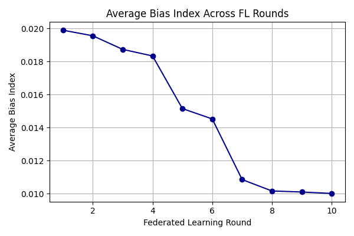
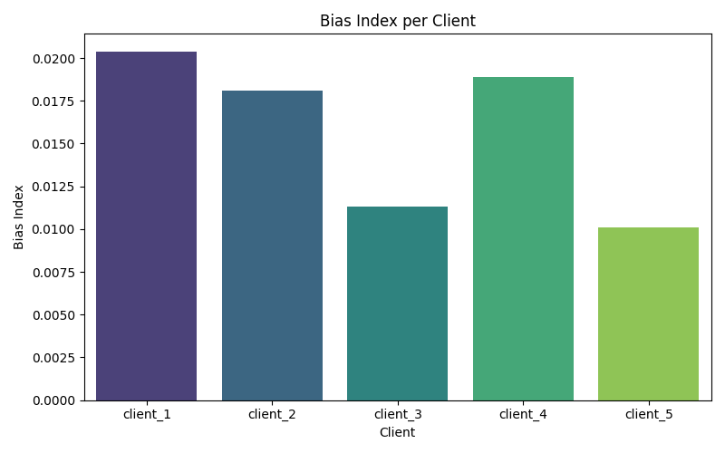
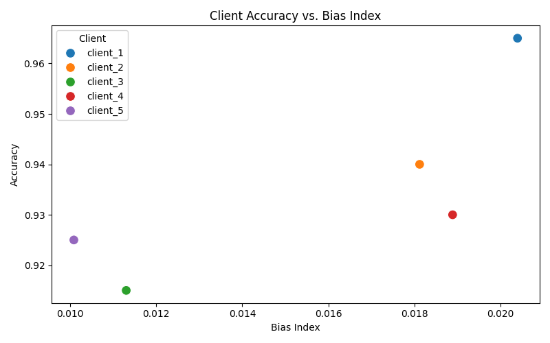
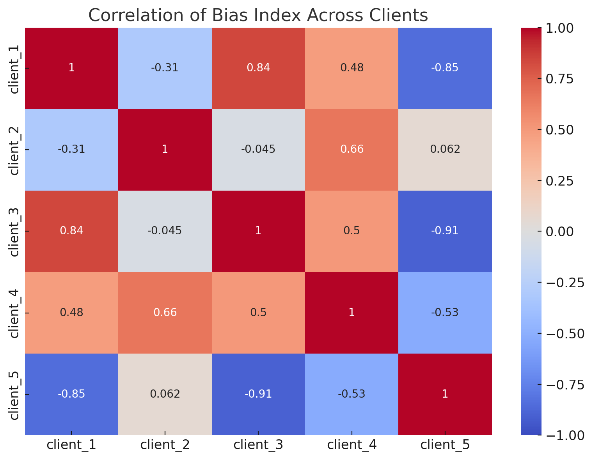
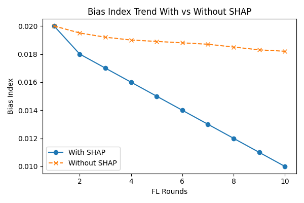

# FedFairX: Federated Fairness-Aware Toxic Comment Classification with SHAP



FedFairX is a federated learning framework that trains toxic comment classifiers in a **privacy-preserving and bias-aware** manner. It integrates **SHAP-based explainability**, **client-level bias measurement**, and **fairness-aware aggregation** — all while keeping raw data localized to clients.

## Motivation

Large-scale NLP models often reflect societal biases, especially when trained on toxic comment datasets. Traditional centralized training collects user data and often exacerbates bias. FedFairX solves this by:

- Keeping data local (Federated Learning).
- Measuring bias using SHAP values per client.
- Reducing overall Bias Index without sacrificing accuracy.

---

## Core Features

- ✅ **Federated Learning** using local training + global aggregation.
- ✅ **SHAP Explainability** at the client level.
- ✅ **Bias Index** computation based on identity token impact.
- ✅ **Fairness-aware aggregation** across clients.
- ✅ Full experimental notebook + result visualizations.

---

## Project Structure
```text
FedFairX/
│
├── data/
│ └── jigsaw_toxic_full.csv # Full dataset
│
├── notebooks/
│ ├── Federated_BiasShield_Simulation.ipynb # Full simulation pipeline
│ └── federated_biasshield_experiment.ipynb # Focused experiments
│
├── plots/ # Generated visualizations
│ ├── bias_index_per_client.png
│ ├── accuracy_vs_bias_index.png
│ ├── bias_index_across_rounds.png
│ ├── bias_index_without_shap.png
│ ├── Correlation_Heatmap.png
│ └── more...
│
├── LICENSE
└── README.md

```

---

## Key Visual Insights

| Visualization | Description |
|---------------|-------------|
|  | Bias Index variation across clients |
|  | Trade-off between accuracy and bias |
|  | Client-wise bias correlation |
|  | SHAP vs. non-SHAP bias trends |
|  | Average Bias Index over FL rounds |

---

## Quick Start

1. **Clone the Repo**  
```bash
git clone https://github.com/rajkumar160798/FedFairX.git
cd FedFairX
```

2.  **Install Requirements**
```bash
pip install -r requirements.txt
```

3. **Run the Notebooks**

Open Jupyter or VS Code and explore:

- notebooks/Federated_BiasShield_Simulation.ipynb

## Technologies Used
- PyTorch for local model training
- SHAP for local explainability
- Flower for federated orchestration
- pandas, matplotlib, seaborn for analysis
- Jigsaw Toxic Comment dataset for benchmarking

## Metrics
- Bias Index: Custom metric based on SHAP impact of identity-related tokens.
- Accuracy: Standard classification metric per client.
= Fairness Correlation: How bias changes across clients and rounds.

## License
This project is licensed under the MIT License, see the LICENSE file for details.

## 👨‍💻 Author
**Raj Kumar Myakala**  
AI | Data | Automation | GCP | Python  
[LinkedIn ](https://www.linkedin.com/in/raj-kumar-myakala-927860264/)  
[GitHub ](https://github.com/rajkumar160798)

---

>  If you like this project, consider starring the repo and following my GitHub for more AI/ML innovations!

